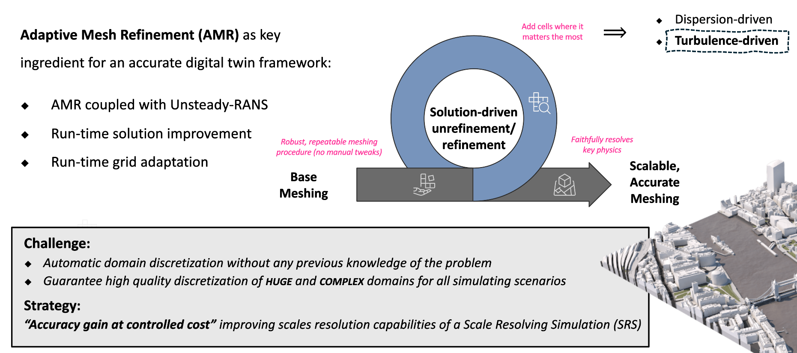
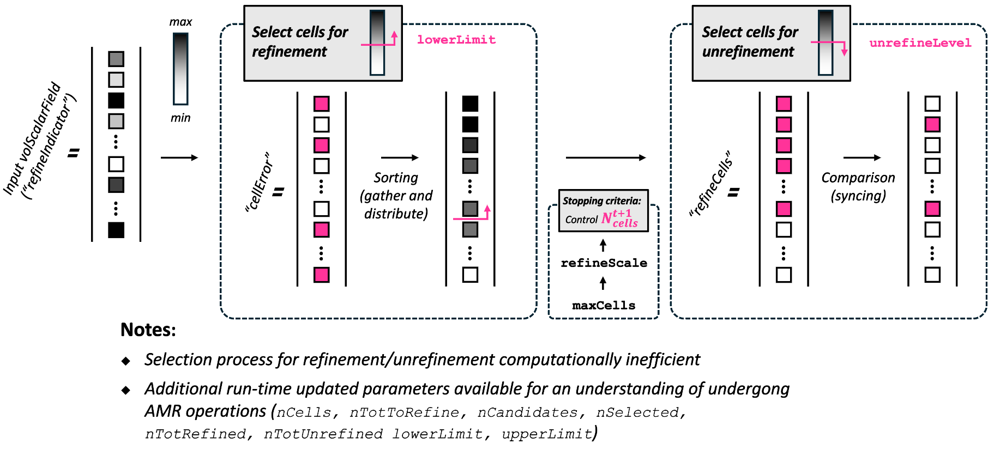
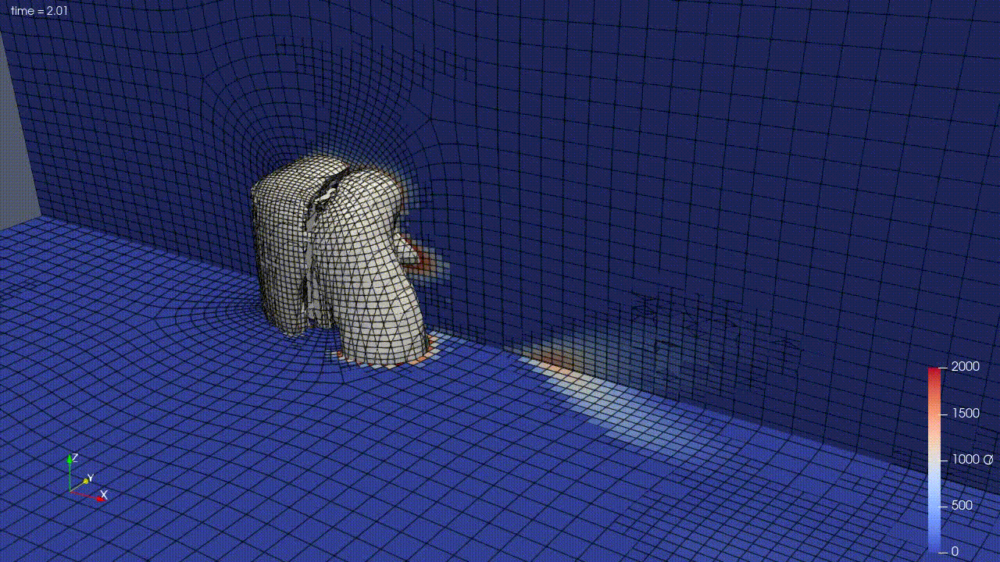
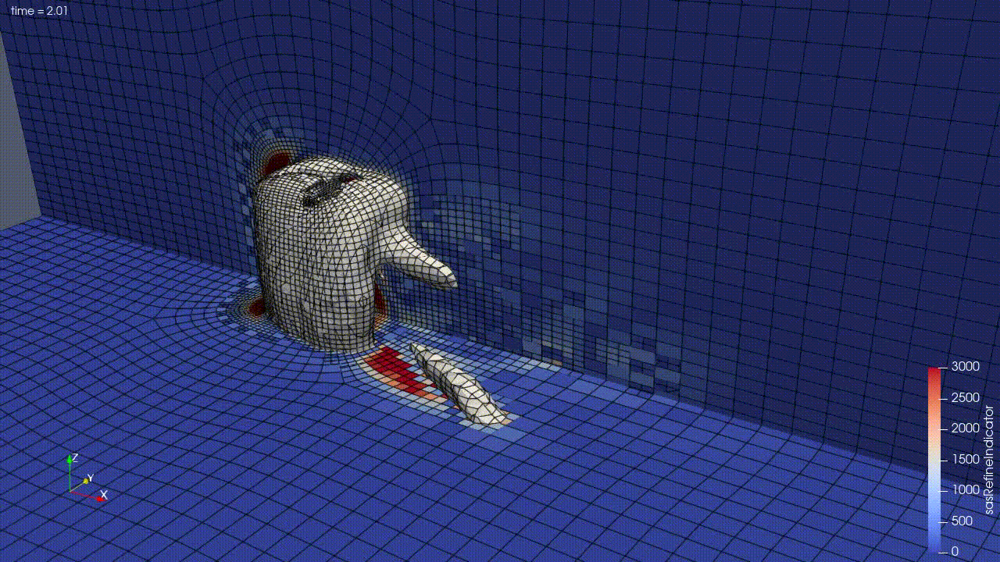

# Refiner topoChanger

Working on adaptive mesh refinement in OpenFOAM.

- [x] Sort candidate cells for refinement based on `cellError` *scalarField*.
- [x] Support both single-processor and parallel runs by reconstructing `cellError` field.
- [x] Stop refine cells once user-defined threshold is reached.
- [x] Add synchronization across processors to ensure consistency across boundaries.
- [x] Make available for processing additional information on adaptive mesh refinement
- [x] Introduce a user-defined time-based smoothing to gradually ramp in cell refinement at startup, still supporting sorting candidate cells for refinement.
- [x] Unrefinement based on user-defined threshold `unrefineLevel` and processed field values.
- [x] Synchronize unrefinement selection across processors (is it really needed?).
- [x] User can now change run-time parameters in `dynamicMeshDict`
- [x] New dictionary entry `unrefineInterval` to control how often unrefinement is performed
- [x] Address incompatibility with `snappyHexMesh` generated grids (some protected cells are refined, leading to crash of the simulation)

By default, `protectedCells_` are mapped after local topology changes. Set
`rebuildProtectedCells true` to rebuild the protected-cell list from the
updated mesh instead of mapping it.

## TODO

1. Fix `myrefiner::distribute()` so redistribution also handles `protectedCells_`: distribute the cached list or force `protectedCellsDirty_ = true` after `meshCutter_.distribute(map)`.
2. Reduce parallel selection cost by avoiding full global `cellError` gather/sort and removing the per-candidate `returnReduce` inside the ranked selection loop.

---

### Why adaptive mesh refinement?

    

### Refiner library visual representation

    

---
### Examples

#### Q-criterion based refinement

    <table>
      <tr>
        <td align="center">
            
           
          <b>Refine vortices-dominated region</b>
        </td>
      </tr>
      <tr>
        <td align="center">
            
           
          <b>Refine in strain-dominated region</b>
        </td>
      </tr>
      <tr>
        <td align="center">
            
           
          <b>Refine both vortex/strain-dominated regions</b>
        </td>
      </tr>
    </table>

#### Von Kàrmàn length scale based refinement

    <table>
      <tr>
        <td align="center">
            
           
          <b>Refine where the high-wave-number filter is active</b>
        </td>
      </tr>
    </table>

---

> [!NOTE]
> - `cellZone` definition for refinement/unrefinement operations is supported.
> 
> - `nBufferLayers` is intentionally not used at the moment: the `extendMarkedCells` step has been disabled because the current selection relies on `meshCutter.consistentRefinement` for 2:1 consistency.
> 
> - If number of selected cells does not exceed the available budget, we have a check on maximum level of refinement.
> 
> - Selected cells for refinement are filtered by the scale value defined by user. So in case we have available spots for all "filtered" cells, we still have to select them based on the sorted field values.
> 
> - Refinement threshold checks are inclusive by design: `cellError >= 0` refines cells exactly on `lowerRefineLevel` or `upperRefineLevel`.
>
> - sorting part of the algorithm and candidates selection (in parallel) are not computationally efficient
> 
> - Candidates cells for unrefinement are now selected based on the field values, with additional synchronization across processors.
> 
> - Available `uniformDimensionedScalarField` for additional post-processing via `dumpRefinementInfo` flag (updated each iteration of refinement/unrefinement):
>     * `nCells`: number of cells at the end of refinement/unrefinement process
>     * `nTotToRefine`: maximum number of cells at that can be generated based on user-defined `maxCells` threshold
>     * `nCandidates`: number of candidate cells for refinement before applying any threshold
>     * `nSelected`: number of candidate cells after maximum cells threshold applied and scale filtering (respectively with `maxCells` and `refinementScale` user-defined parameters)
>     * `nToTRefined`: number of cells actually refined in that iteration (after 2:1 consistency and after checking maximum refinement level allowed)
>     * `nToUnrefined`: number of cells unrefined
>     * `lowerLimit`: lower limit threshold applied on `cellError`
>     * `upperLimit`: upper limit threshold applied on `cellError`
>     * `nAtMaxRefinement`: number of cells at maximum refinement level (after refinement))
> 
> - Available `volScalarField` associated with `cellError` for additional post-processing via `dumpRefinementFields` flag.
> 
> - Available `protectedCells` cellSet via `dumpProtectedCells` flag.
> 
> - Available `labelIOList` of refined and unrefined cells with debugging flag
> 
> - Need to check the behaviour with `refinementRegions` definition (which changed in later version of OpenFOAM)
> 
> - Experienced instabilities with time-step adaptation via `adjustTimeStep`(-> `maxCo`) leading to simulation crash. Need to change the logic to avoid abrupt changes or fix directly the time-step
---
