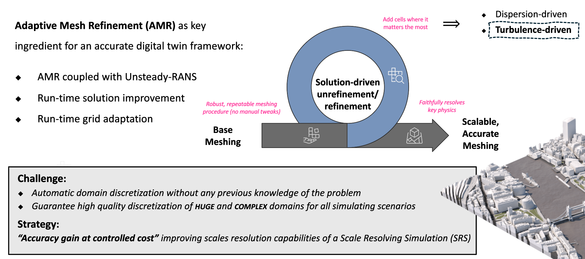
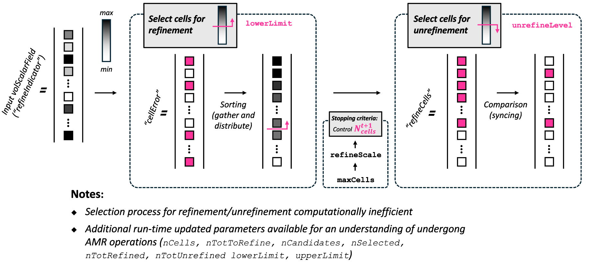
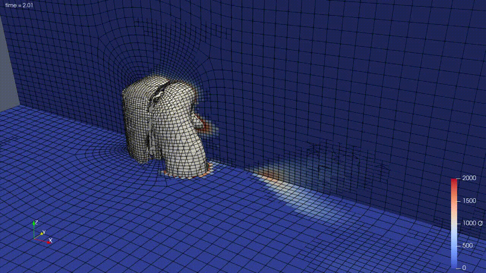
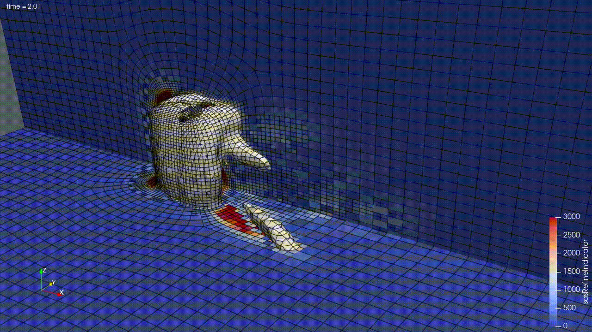

# Refiner topoChanger

Working on adaptive mesh refinement in OpenFOAM.

- [x] Sort candidate cells for refinement based on `cellError` *scalarField*.
- [x] Support serial and parallel refinement with globally ranked candidate selection.
- [x] Limit the initial refinement selection using `maxCells` and the refinement scale. Subsequent 2:1 consistency may add cells beyond this budget.
- [x] Add synchronization across processors to ensure consistency across boundaries.
- [x] Make available for processing additional information on adaptive mesh refinement
- [x] Introduce a user-defined time-based smoothing to gradually ramp in cell refinement at startup, still supporting sorting candidate cells for refinement.
- [x] Unrefinement based on user-defined threshold `unrefineLevel` and processed field values.
- [x] Synchronize unrefinement selection across processors (is it really needed?).
- [x] Selected parameters in `dynamicMeshDict` can be changed at runtime; see the runtime-editing note below.
- [x] New dictionary entry `unrefineInterval` to control how often unrefinement is performed
- [x] Address incompatibility with `snappyHexMesh` generated grids (some protected cells are refined, leading to crash of the simulation)
- [x] Reduce parallel refinement selection cost by keeping `cellError` local and gathering only compact top-ranked candidates.

## TODO

1. Fix `myrefiner::distribute()` so redistribution also handles `protectedCells_`: distribute the cached list after `meshCutter_.distribute(map)`.
2. Investigate whether mapping `refineCells` instead of `refinableCells` after refinement would affect unrefinement selection. The current mapping updates `refinableCells`, while unrefinement reads `refineCells`.

---

### Why adaptive mesh refinement?

    

### Refiner library visual representation

    

---
### Examples

#### Q-criterion based refinement

    <table>
      <tr>
        <td align="center">
            
           
          <b>Refine vortices-dominated region</b>
        </td>
      </tr>
      <tr>
        <td align="center">
            
           
          <b>Refine in strain-dominated region</b>
        </td>
      </tr>
      <tr>
        <td align="center">
            
           
          <b>Refine both vortex/strain-dominated regions</b>
        </td>
      </tr>
    </table>

#### Von Kàrmàn length scale based refinement

    <table>
      <tr>
        <td align="center">
            
           
          <b>Refine where the high-wave-number filter is active</b>
        </td>
      </tr>
    </table>

---

> [!NOTE]
> - Runtime editing applies to selected entries in `dynamicMeshDict/topoChanger`: `refineInterval`, `unrefineInterval`, `maxCells`, `dumpRefinementInfo`, `dumpRefinementFields`, `dumpProtectedCells`, and `rebuildProtectedCells` are refreshed on the first update call of each timestep. Field-selection entries (`field`, `lowerRefineLevel`, `upperRefineLevel`, `maxRefinement`, `cellZone`, and `unrefineLevel`) are read when the corresponding selection runs. `refineScale` is refreshed when present and `refineInterval` evaluates to a nonzero interval; removing it retains the previously loaded function, so set `refineScale 1;` explicitly to restore full scale. `nBufferLayers`, `correctFluxes`, and `dumpLevel` are read only at initialization and require a restart for changes to take effect.
>
> - `cellZone` definition for initial refinement candidate selection is supported. Buffering and 2:1 consistency may extend refinement beyond the zone; unrefinement does not apply an explicit zone filter.
> 
> - `nBufferLayers` extends the marked cells through face neighbours before refinement selection. The extended mask also protects neighbouring cells from unrefinement. The subsequent `consistentRefinement` step enforces 2:1 consistency.
> 
> - Candidates already at `maxRefinement` are excluded before applying the refinement budget and scale.
> 
> - Selected cells for refinement are filtered by the scale value defined by user. So in case we have available spots for all "filtered" cells, we still have to select them based on the sorted field values.
> 
> - Refinement threshold checks are inclusive by design: `cellError >= 0` refines cells exactly on `lowerRefineLevel` or `upperRefineLevel`.
>
> - When truncation is required, each processor contributes up to `nToSelect` locally top-ranked eligible candidates. Their errors and global cell IDs are gathered and scattered, and every processor selects the same global top `nToSelect` candidates, or all eligible candidates if fewer are available. The full `cellError` field remains local.
> 
> - Candidates cells for unrefinement are now selected based on the field values, with additional synchronization across processors.
> 
> - Available `uniformDimensionedScalarField` for additional post-processing via `dumpRefinementInfo` flag (updated at the corresponding selection or mesh-change steps; some values may retain earlier results when those steps are skipped):
>     * `nCells`: total mesh cell count, updated at the end of the scheduled unrefinement branch.
>     * `nTotToRefine`: initial budget of parent cells to refine, calculated as `(maxCells - current total cells)/7`.
>     * `nCandidates`: candidate count after buffering and maximum-refinement-level filtering, before protected-cell filtering, budget truncation, and scaling.
>     * `nSelected`: requested candidate count after applying the `maxCells` budget and `refineScale`, before protected-cell filtering and 2:1 consistency adjustments.
>     * `nTotRefined`: number of parent cells selected for refinement after consistency and protected-cell handling.
>     * `nTotUnrefined`: number of cells reported by the unrefinement operation.
>     * `lowerLimit`: minimum `cellError` among initially selected candidates, before 2:1 consistency adjustments.
>     * `upperLimit`: maximum `cellError` among initially selected candidates, before 2:1 consistency adjustments.
>     * `nAtMaxRefinement`: number of mesh cells at or above `maxRefinement`, measured before refinement.
> 
> - Available `volScalarField` associated with `cellError` for additional post-processing via `dumpRefinementFields` flag.
> 
> - Available `protectedCells` cellSet via `dumpProtectedCells` flag.
> 
> - Available `labelIOList` of refined and unrefined cells with debugging flag
> 
> - Need to check the behaviour with `refinementRegions` definition (which changed in later version of OpenFOAM)
> 
> - Experienced instabilities with time-step adaptation via `adjustTimeStep`(-> `maxCo`) leading to simulation crash. Need to change the logic to avoid abrupt changes or fix directly the time-step

> - By default, `protectedCells_` are mapped after local topology changes. Set `rebuildProtectedCells true` to rebuild the protected-cell list from the updated mesh instead of mapping it.

---
